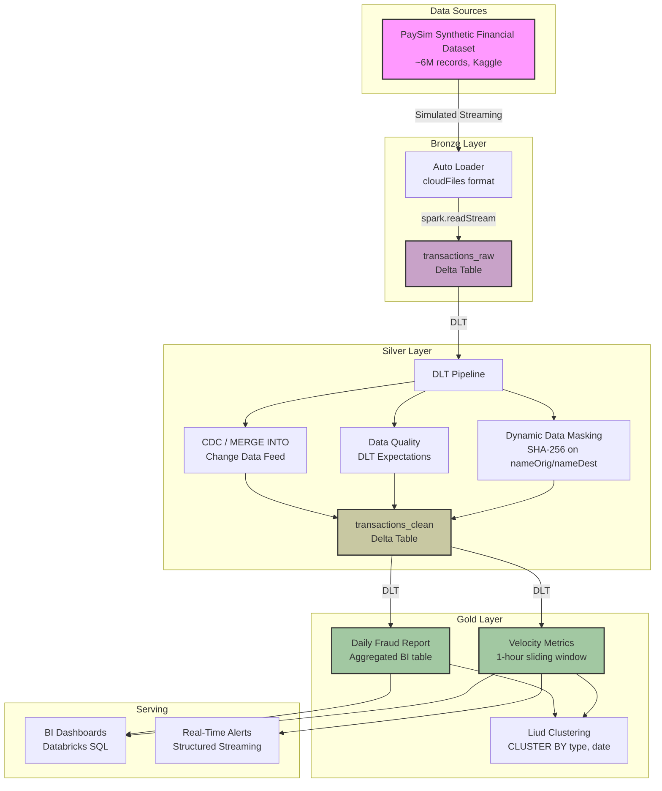
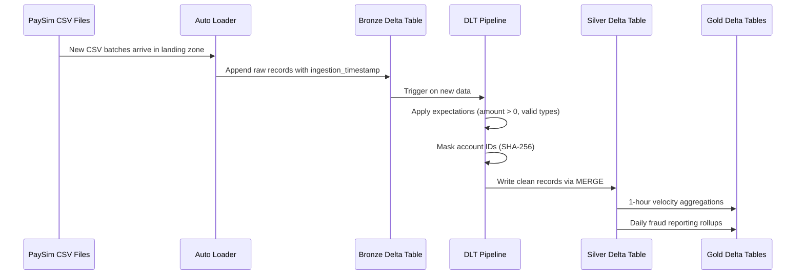
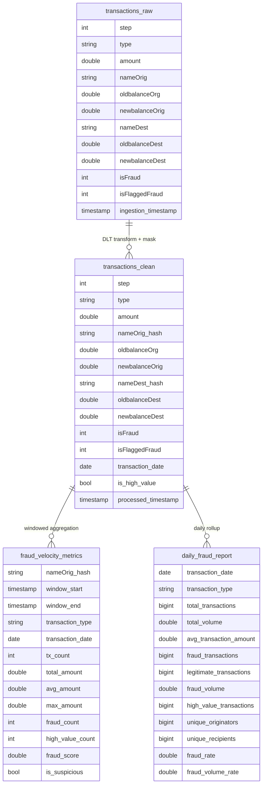

# Architecture: Medallion Lakehouse for Fraud Detection

```mermaid
graph TB
    subgraph Data Sources
        A[PaySim Synthetic Financial Dataset<br/>~6M records, Kaggle]
    end

    subgraph Bronze Layer
        B[Auto Loader<br/>cloudFiles format]
        C[transactions_raw<br/>Delta Table]
    end

    subgraph Silver Layer
        D[DLT Pipeline]
        E[Dynamic Data Masking<br/>SHA-256 on nameOrig/nameDest]
        F[Data Quality<br/>DLT Expectations]
        G[CDC / MERGE INTO<br/>Change Data Feed]
        H[transactions_clean<br/>Delta Table]
    end

    subgraph Gold Layer
        I[Velocity Metrics<br/>1-hour sliding window]
        J[Daily Fraud Report<br/>Aggregated BI table]
        K[Liud Clustering<br/>CLUSTER BY type, date]
    end

    subgraph Serving
        L[BI Dashboards<br/>Databricks SQL]
        M[Real-Time Alerts<br/>Structured Streaming]
    end

    A -->|Simulated Streaming| B
    B -->|spark.readStream| C
    C -->|DLT| D
    D --> E
    D --> F
    D --> G
    E & F & G --> H
    H -->|DLT| I
    H -->|DLT| J
    I --> K
    J --> K
    I & J --> L
    I --> M

    style A fill:#f9f,stroke:#333,stroke-width:2px
    style C fill:#c8a2c8,stroke:#333,stroke-width:2px
    style H fill:#c8c8a2,stroke:#333,stroke-width:2px
    style I fill:#a2c8a2,stroke:#333,stroke-width:2px
    style J fill:#a2c8a2,stroke:#333,stroke-width:2px
```

## Data Flow

```mermaid
sequenceDiagram
    participant CSV as PaySim CSV Files
    participant AL as Auto Loader
    participant Bronze as Bronze Delta Table
    participant DLT as DLT Pipeline
    participant Silver as Silver Delta Table
    participant Gold as Gold Delta Tables

    CSV->>AL: New CSV batches arrive in landing zone
    AL->>Bronze: Append raw records with ingestion_timestamp
    Bronze->>DLT: Trigger on new data
    DLT->>DLT: Apply expectations (amount > 0, valid types)
    DLT->>DLT: Mask account IDs (SHA-256)
    DLT->>Silver: Write clean records via MERGE
    Silver->>Gold: 1-hour velocity aggregations
    Silver->>Gold: Daily fraud reporting rollups
```

## Delta Table Relationships

```mermaid
erDiagram
    transactions_raw {
        int step
        string type
        double amount
        string nameOrig
        double oldbalanceOrg
        double newbalanceOrig
        string nameDest
        double oldbalanceDest
        double newbalanceDest
        int isFraud
        int isFlaggedFraud
        timestamp ingestion_timestamp
    }

    transactions_clean {
        int step
        string type
        double amount
        string nameOrig_hash
        double oldbalanceOrg
        double newbalanceOrig
        string nameDest_hash
        double oldbalanceDest
        double newbalanceDest
        int isFraud
        int isFlaggedFraud
        date transaction_date
        bool is_high_value
        timestamp processed_timestamp
    }

    fraud_velocity_metrics {
        string nameOrig_hash
        timestamp window_start
        timestamp window_end
        string transaction_type
        date transaction_date
        int tx_count
        double total_amount
        double avg_amount
        double max_amount
        int fraud_count
        int high_value_count
        double fraud_score
        bool is_suspicious
    }

    daily_fraud_report {
        date transaction_date
        string transaction_type
        bigint total_transactions
        double total_volume
        double avg_transaction_amount
        bigint fraud_transactions
        bigint legitimate_transactions
        double fraud_volume
        bigint high_value_transactions
        bigint unique_originators
        bigint unique_recipients
        double fraud_rate
        double fraud_volume_rate
    }

    transactions_raw ||--o{ transactions_clean : "DLT transform + mask"
    transactions_clean ||--o{ fraud_velocity_metrics : "windowed aggregation"
    transactions_clean ||--o{ daily_fraud_report : "daily rollup"
```
